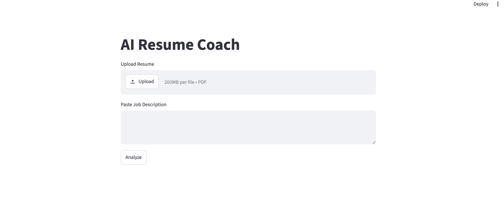
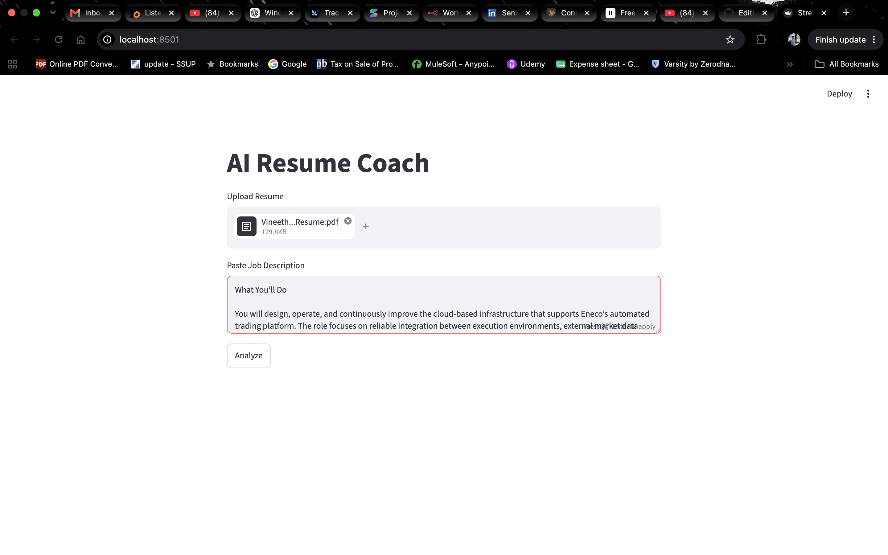
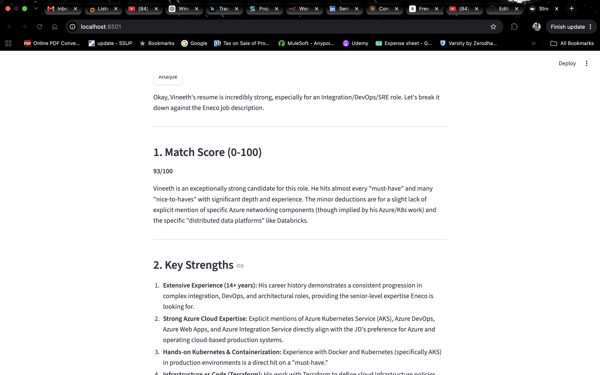
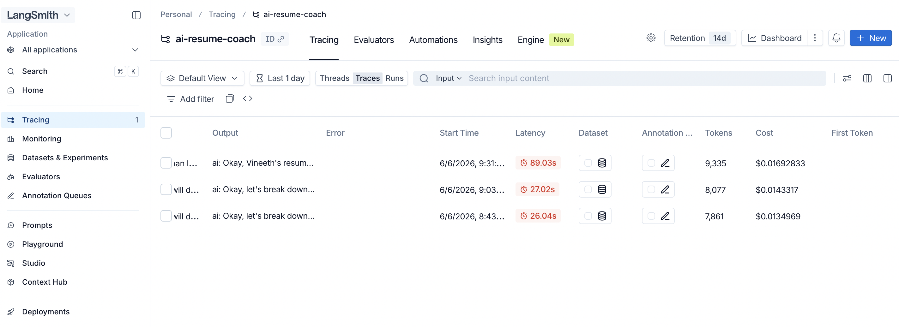

# 💼 AI Resume Coach

An AI-powered tool that analyzes a resume against a job description and provides a match score, missing skills, and interview insights using LLMs.

---

## 🚀 Features

- Upload resume (PDF)
- Paste job description
- AI-based match analysis
- Skill gap detection
- Interview questions
- Improvement suggestions
- LangSmith tracing enabled

---

## 🧠 Tech Stack

- Python
- Streamlit
- LangChain
- Google Gemini API
- LangSmith
- PyPDF

---

## 🏗️ Workflow

Streamlit UI ➜ PDF Extraction ➜ Resume + JD ➜ LangChain ➜ Gemini ➜ Output ➜ Streamlit

LangSmith tracks execution

---

## 📸 Screenshots

### UI Landing Page

### UI Input

### AI Analysis Output

### LangSmith Tracing

--- 

## 🚀 Next Steps

This is an MVP version. Planned improvements are:

### 📚 Add RAG (Retrieval-Augmented Generation)
- Store resumes and job descriptions in a vector database
- Improve context-aware matching using embeddings
- Enable smarter, more accurate skill gap analysis

### 🧠 Integrate Vector Database
- Use tools like FAISS / ChromaDB
- Store past resumes and job descriptions
- Enable similarity search between resumes and roles

### 🔍 Improve Search & Matching
- Add semantic search for job-resume matching
- Rank relevance of skills instead of rule-based scoring
- Compare multiple resumes for same job

### 📊 Better Output Structuring
- Add structured scoring system (match %, skill gap score)
- Improve explanation quality using structured prompts

### 🌐 Deployment
- Deploy on Streamlit Cloud / Render
- Add public demo link

### 🧪 Experimentation
- Try different models (Gemini vs open-source like Phi-3)
- Improve prompt engineering for better accuracy
- Add LangSmith evaluation datasets
